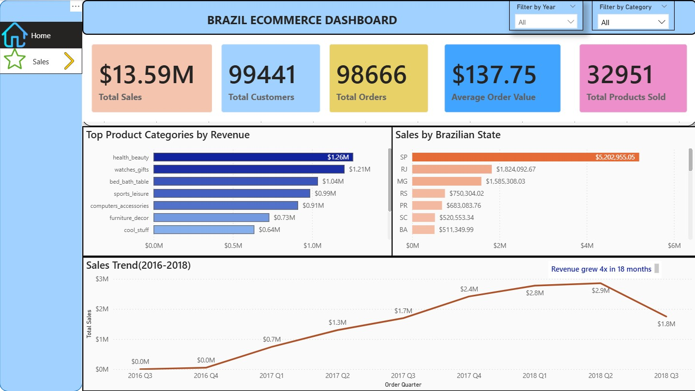

\# Brazil E-Commerce Sales Analytics Dashboard

\## Overview

Interactive Power BI dashboard analyzing 2 years of e-commerce data from a 

Brazilian online marketplace (2016-2018).

\## Dataset

\- \*\*Source\*\*: Brazil E-Commerce Public Dataset (Kaggle/Olist)

\- \*\*Size\*\*: 100,000+ orders, $13.6M revenue

\- \*\*Scope\*\*: 99,441 customers, 72 product categories, 32,951 products

\## Key Features

\- 📊 10 KPI metrics with year-over-year comparisons

\- 📈 Interactive filtering (Year + Category)

\- 🗺️ Geographic analysis across Brazilian states

\- 📉 Quarterly trend analysis (2016-2018)

\- 🎯 Conditional formatting and enhanced tooltips

\## Technical Stack

\- Power BI Desktop

\- DAX (Data Analysis Expressions)

\- Power Query (M Language)

\- Star Schema Data Modeling

\## Key Insights

\- 💰 \*\*148x Revenue Growth\*\*: $50K (2016) → $7.4M (2018), Revenue growth from 2016 to 2017 is because 2016 was partial year.

\- 📈 \*\*12,264% YoY Growth\*\* (2016-2017): Product-market fit achieved

\- 💄 \*\*Top Category\*\*: Health \& Beauty ($1.26M revenue)

\- 🏙️ \*\*Top Region\*\*: São Paulo (38% of total sales)

\- ⚠️ \*\*Q3 2018 Decline\*\*: 39% drop requiring investigation

\## Files

\- `Brazil\_Ecommerce\_Dashboard\_Final.pbix` - Power BI file

\- `Brazil\_Ecommerce\_Dashboard\_Full.jpg` - Dashboard screenshot

\- `Brazil\_Ecommerce\_Dashboard\_Portfolio.pdf` - Shareable PDF

## Dashboard Preview

\## Skills Demonstrated

\- Data Modeling (Star Schema)

\- DAX (Measures \& Calculated Columns)

\- Power Query (ETL \& Transformations)

\- Data Visualization Best Practices

\- Business Intelligence \& Analytics

\- Interactive Dashboard Design

\## Model Preview

\## Some DAX Measures used

Average Order Value = DIVIDE([Total Sales],[Total Orders],0)

Total Orders = DISTINCTCOUNT(Order_Items[order_id])

Growth 2017 vs 2016 = DIVIDE([Sales 2017] - [Sales 2016], [Sales 2016], 0)

Growth 2018 vs 2017 = DIVIDE([Sales 2018] - [Sales 2017], [Sales 2017], 0)

## How to Use
1. Download the `.pbix` file (if you add it)
2. Open in Power BI Desktop
3. Explore the interactive dashboard
4. Review `TECHNICAL_DECISIONS.pdf` for methodology

## Contact
**Tsheten Sherpa**
- Email: tshetenN.sherpa@gmail.com
- LinkedIn: [Your Profile Link]
- Portfolio: [Link to other projects]
\[LinkedIn Profile]

